# 1.2 Estrutura Analítica do Projeto (EAP / WBS)

> **O que é:** decomposição visual de todo o trabalho do projeto em partes
> menores. Mostra **o quê** será entregue, não **quando**.
>
> **Regra:** Nível 0 = projeto · Nível 1 = disciplinas · Nível 2 = fases · Nível 3 = entregas reais.

---

## EAP em formato hierárquico (texto)

```
0.0 Projeto Barbearia Invictus
├── 1.0 Gestão de Projetos (D1)
│   ├── 1.1 Documentação do projeto
│   │   ├── 1.1.1 TAP assinado pelo Sponsor
│   │   ├── 1.1.2 EAP em diagrama (este documento)
│   │   ├── 1.1.3 Backlog do Produto (User Stories)
│   │   ├── 1.1.4 Matriz RACI
│   │   ├── 1.1.5 Gráfico de Gantt
│   │   └── 1.1.6 Planilha de custos
│   ├── 1.2 Atas e Comprovações
│   │   ├── 1.2.1 Ata de Kickoff (com assinatura do Sponsor)
│   │   ├── 1.2.2 Atas de Reunião Semanal (mín. 8 atas)
│   │   └── 1.2.3 Prints do board Trello/GitHub Projects
│   └── 1.3 Plano de Riscos atualizado
│
├── 2.0 Engenharia de Software (Backend FastAPI)
│   ├── 2.1 Modelagem de Dados
│   │   ├── 2.1.1 Modelos SQLAlchemy (Cliente, Barbeiro, Serviço, Agendamento, Produto, AdminUser, AuditLog)
│   │   └── 2.1.2 Script de seed (dados iniciais)
│   ├── 2.2 Camada de Rotas (FastAPI)
│   │   ├── 2.2.1 Rotas públicas (home, agendar, produtos, privacidade)
│   │   ├── 2.2.2 Rotas administrativas (CRUD completo + dashboard)
│   │   └── 2.2.3 Rotas LGPD (consentimento, anonimização, política)
│   └── 2.3 Camada de Apresentação (Jinja2 + CSS)
│       ├── 2.3.1 Tema dark com identidade visual da barbearia
│       └── 2.3.2 Templates HTML responsivos
│
├── 3.0 Análise de Dados (D2)
│   ├── 3.1 Pipeline de Extração
│   │   └── 3.1.1 Endpoints `/admin/export/*.csv` (FastAPI)
│   ├── 3.2 Notebooks Jupyter
│   │   ├── 3.2.1 ETL + KPIs + estatística (`01_etl_e_kpis.ipynb`)
│   │   └── 3.2.2 6 visualizações (`02_visualizacoes.ipynb`)
│   └── 3.3 Análise crítica documentada (resposta às perguntas obrigatórias)
│
├── 4.0 Segurança da Informação (D3)
│   ├── 4.1 Controles técnicos
│   │   ├── 4.1.1 Hash bcrypt + rate-limiting
│   │   ├── 4.1.2 Cabeçalhos HTTP de segurança (CSP, HSTS, X-Frame-Options)
│   │   └── 4.1.3 Audit log de ações administrativas
│   ├── 4.2 Conformidade LGPD
│   │   ├── 4.2.1 Política de privacidade pública
│   │   ├── 4.2.2 Consentimento explícito no agendamento
│   │   └── 4.2.3 Endpoint de anonimização de dados
│   └── 4.3 Documentação D3 (`docs/d3_seguranca.md` — Matriz GUT, IAM, RoPA)
│
├── 5.0 Pesquisa Operacional (D4)
│   ├── 5.1 Modelagem de problemas
│   │   ├── 5.1.1 Maximização de lucro (`03_otimizacao_lucro.ipynb`)
│   │   └── 5.1.2 Minimização de custo de alocação (`04_otimizacao_alocacao.ipynb`)
│   └── 5.2 Análise What-If documentada
│
└── 6.0 Homologação e Entrega Final
    ├── 6.1 Testes manuais de aceitação (com checklist do TAP)
    ├── 6.2 PDF consolidado das 4 disciplinas
    ├── 6.3 Apresentação final (banca)
    └── 6.4 Repositório GitHub público (tag `v1.0`)
```

---

## EAP em formato tabular (para imprimir/exportar)

| ID | Pacote de trabalho | Nível | Responsável principal |
|---|---|---|---|
| 0.0 | Projeto Barbearia Invictus | 0 | João Falbi (PM) |
| 1.0 | Gestão de Projetos | 1 | João Falbi |
| 1.1.1 | TAP | 3 | João Falbi |
| 1.1.2 | EAP | 3 | João Falbi |
| 1.1.3 | Backlog | 3 | João Falbi |
| 1.1.4 | Matriz RACI | 3 | João Falbi |
| 1.1.5 | Gantt | 3 | João Falbi |
| 1.1.6 | Custos | 3 | João Falbi |
| 1.2.1 | Ata de Kickoff | 3 | João Falbi |
| 1.2.2 | Atas semanais | 3 | João Falbi |
| 2.0 | Backend FastAPI | 1 | João Falbi |
| 2.1.1 | Modelos SQLAlchemy | 3 | João Falbi |
| 2.1.2 | Seed | 3 | João Falbi |
| 2.2.1 | Rotas públicas | 3 | João Falbi |
| 2.2.2 | Rotas admin | 3 | João Falbi |
| 2.2.3 | Rotas LGPD | 3 | Diego Lima |
| 2.3.1 | Tema dark CSS | 3 | João Falbi |
| 2.3.2 | Templates HTML | 3 | João Falbi |
| 3.0 | Análise de Dados | 1 | Calebe Ramos |
| 3.1.1 | Endpoints CSV | 3 | João Falbi |
| 3.2.1 | Notebook ETL+KPIs | 3 | Calebe Ramos |
| 3.2.2 | Notebook Visualizações | 3 | Calebe Ramos |
| 3.3 | Análise crítica | 3 | Calebe Ramos |
| 4.0 | Segurança da Informação | 1 | Diego Lima |
| 4.1.1 | Bcrypt + rate-limit | 3 | Diego Lima |
| 4.1.2 | Cabeçalhos HTTP | 3 | Diego Lima |
| 4.1.3 | Audit log | 3 | Diego Lima |
| 4.2.1 | Política de privacidade | 3 | Diego Lima |
| 4.2.2 | Consentimento LGPD | 3 | Diego Lima |
| 4.2.3 | Anonimização | 3 | Diego Lima |
| 4.3 | docs/d3_seguranca.md | 3 | Diego Lima |
| 5.0 | Pesquisa Operacional | 1 | Guilherme Pimenta |
| 5.1.1 | Notebook lucro (PuLP) | 3 | Guilherme Pimenta |
| 5.1.2 | Notebook alocação (PuLP) | 3 | Guilherme Pimenta |
| 5.2 | What-If documentado | 3 | Guilherme Pimenta |
| 6.0 | Homologação | 1 | João Falbi |
| 6.1 | Testes de aceitação | 3 | Equipe toda |
| 6.2 | PDF consolidado | 3 | João Falbi |
| 6.3 | Apresentação banca | 3 | Equipe toda |
| 6.4 | Tag v1.0 GitHub | 3 | João Falbi |

---

## Diagrama visual (Mermaid — renderiza direto no GitHub)

```mermaid
graph TD
    P[0.0 Projeto Barbearia Invictus]

    P --> D1[1.0 Gestão de Projetos]
    P --> D2BE[2.0 Backend FastAPI]
    P --> D2[3.0 Análise de Dados]
    P --> D3[4.0 Segurança da Informação]
    P --> D4[5.0 Pesquisa Operacional]
    P --> D5[6.0 Homologação e Entrega]

    D1 --> D1A[1.1 Documentação<br/>TAP, EAP, RACI, Gantt, Custos]
    D1 --> D1B[1.2 Atas e Comprovações]

    D2BE --> BE1[2.1 Modelos SQLAlchemy]
    D2BE --> BE2[2.2 Rotas FastAPI]
    D2BE --> BE3[2.3 Templates + CSS]

    D2 --> ETL[3.1 ETL endpoints CSV]
    D2 --> NB[3.2 Notebooks Jupyter]
    D2 --> CRIT[3.3 Análise crítica]

    D3 --> SEC1[4.1 Bcrypt + Rate-limit + Audit log]
    D3 --> SEC2[4.2 LGPD]
    D3 --> SEC3[4.3 docs/d3_seguranca.md]

    D4 --> PO1[5.1 Lucro PuLP]
    D4 --> PO2[5.2 Alocação PuLP]

    D5 --> H1[6.1 Testes]
    D5 --> H2[6.2 PDF final]
    D5 --> H3[6.3 Banca]

    classDef proj fill:#1e293b,stroke:#dc2626,stroke-width:3px,color:#fff
    classDef nivel1 fill:#7f1d1d,stroke:#dc2626,color:#fff
    class P proj
    class D1,D2BE,D2,D3,D4,D5 nivel1
```



> O GitHub renderiza Mermaid automaticamente. Para o **PDF da banca**,
> abrir o arquivo no GitHub, dar print do diagrama e salvar como PNG.
>
> Alternativa offline: copiar o bloco Mermaid acima e colar em
> <https://mermaid.live> para exportar SVG/PNG sem cadastro.
