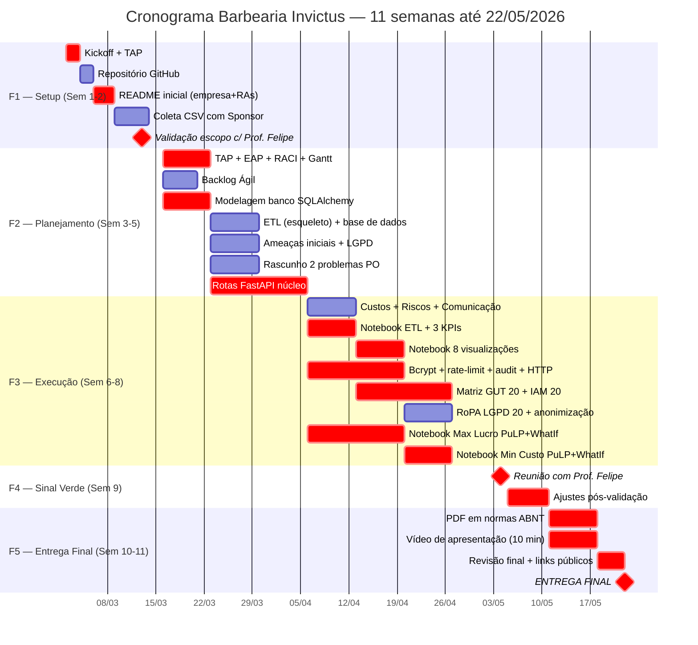

# 1.4 Gestão de Cronograma (Gantt)

> **O que é:** calendário visual do projeto mostrando as **dependências** entre as tarefas (pré-requisitos).
>
> **Alinhamento ao guia oficial:** o cronograma está estruturado nas **5 Fases** definidas pelo Prof. Felipe, com **data limite de entrega 22/05/2026** e **Validação "Sinal Verde" obrigatória** na primeira quinzena de maio.

---

## As 5 Fases oficiais da disciplina

| Fase | Nome | Período | Semanas |
|:-:|---|---|:-:|
| **F1** | Setup e Organização Inicial | 02/03 — 15/03/2026 | 1-2 |
| **F2** | Planejamento Base + Início Paralelo | 16/03 — 05/04/2026 | 3-5 |
| **F3** | Execução e Integração (Mão na Massa) | 06/04 — 26/04/2026 | 6-8 |
| **F4** | ⚠️ **Validação Geral Obrigatória ("Sinal Verde")** | 27/04 — 10/05/2026 | 9 |
| **F5** | Entrega Final Oficial | 11/05 — **22/05/2026** | 10-11 |

---

## Cronograma detalhado

| ID | Atividade | Início | Término | Dura | Depende de | Resp. |
|--:|---|:-:|:-:|--:|---|---|
| **— Fase 1: Setup —** | | | | | | |
| 1 | Reunião de Kickoff e assinatura do TAP | 02/03 | 03/03 | 2d | — | João Falbi |
| 2 | Criação do repositório GitHub + pasta compartilhada | 02/03 | 03/03 | 2d | 1 | João Falbi |
| 3 | README inicial (empresa, ramo, problema, equipe, RAs) | 04/03 | 06/03 | 3d | 2 | João Falbi |
| 4 | **Validação do escopo com Prof. Felipe** | 13/03 | 13/03 | 1d | 3 | Equipe toda |
| 5 | Coleta de dados reais com Sponsor (CSV de agendamentos) | 09/03 | 13/03 | 5d | 1 | João Falbi |
| **— Fase 2: Planejamento + Paralelo —** | | | | | | |
| 6 | TAP, EAP, Matriz RACI, Gantt | 16/03 | 22/03 | 7d | 4 | João Falbi |
| 7 | Backlog Ágil (User Stories) + Sprints | 16/03 | 20/03 | 5d | 4 | João Falbi |
| 8 | Modelagem de banco SQLAlchemy + seed | 16/03 | 22/03 | 7d | 4 | João Falbi |
| 9 | Definição da base de dados + scripts ETL (esqueleto) | 23/03 | 29/03 | 7d | 8 | Calebe Ramos |
| 10 | Mapeamento de Ameaças (lista inicial) + adequação LGPD | 23/03 | 29/03 | 7d | 4 | Diego Lima |
| 11 | Rascunho dos 2 problemas de PO | 23/03 | 29/03 | 7d | 4 | Guilherme Pimenta |
| 12 | Rotas FastAPI públicas + admin (núcleo) | 23/03 | 05/04 | 14d | 8 | João Falbi |
| **— Fase 3: Execução / Mão na Massa —** | | | | | | |
| 13 | Custos, Plano de Riscos, Plano de Comunicação | 06/04 | 12/04 | 7d | 6 | João Falbi |
| 14 | Notebook ETL + 3 KPIs (`01_etl_e_kpis.ipynb`) | 06/04 | 12/04 | 7d | 9 | Calebe Ramos |
| 15 | Notebook 8 visualizações (`02_visualizacoes.ipynb`) | 13/04 | 19/04 | 7d | 14 | Calebe Ramos |
| 16 | Bcrypt + rate-limit + audit log + headers HTTP | 06/04 | 19/04 | 14d | 12 | Diego Lima |
| 17 | Matriz GUT pontuada (20 ameaças) + Políticas IAM (20) | 13/04 | 26/04 | 14d | 10 | Diego Lima |
| 18 | RoPA LGPD completa (20 dados) + endpoints anonimização | 20/04 | 26/04 | 7d | 16 | Diego Lima |
| 19 | Notebook PuLP — Maximização Lucro + What-If | 06/04 | 19/04 | 14d | 11 | Guilherme Pimenta |
| 20 | Notebook PuLP — Minimização Custo + What-If | 20/04 | 26/04 | 7d | 19 | Guilherme Pimenta |
| **— Fase 4: 🟢 Validação "Sinal Verde" —** | | | | | | |
| 21 | Reunião de validação com **Prof. Felipe** | 04/05 | 04/05 | 1d | 13,15,18,20 | Equipe toda |
| 22 | Ajustes solicitados pelo Prof. Felipe | 05/05 | 10/05 | 6d | 21 | Equipe toda |
| **— Fase 5: Entrega Final —** | | | | | | |
| 23 | Compilar **PDF em normas ABNT** (capa, sumário, referências) | 11/05 | 17/05 | 7d | 22 | João Falbi |
| 24 | Gravar e editar **vídeo de apresentação (10 min)** | 11/05 | 17/05 | 7d | 22 | Equipe toda |
| 25 | Revisão final + verificação de links públicos | 18/05 | 21/05 | 4d | 23,24 | Equipe toda |
| 26 | **🚩 ENTREGA FINAL** — submissão do PDF e vídeo | 22/05 | 22/05 | 1d | 25 | João Falbi |

---

## Caminho Crítico

> Sequência que **não pode atrasar** — qualquer slip aqui atrasa a entrega final de 22/05.

```
1 → 4 → 6 → 8 → 12 → 16 → 17 → 18 → 21 → 22 → 23 → 25 → 26
```

⚠️ **Atenção máxima:**
- **#4** Validação de escopo (sem aprovação do Prof. Felipe, projeto reinicia)
- **#21** ⚠️ **Sinal Verde** — milestone obrigatório; sem ele a Fase 5 não começa
- **#23** PDF ABNT — sem ABNT correta, **nota cai automaticamente**
- **#26** Entrega final em 22/05 — **improrrogável**

---

## Diagrama Gantt visual (Mermaid — renderiza no GitHub)



> O GitHub renderiza Mermaid automaticamente. Para PNG da banca: abra o
> arquivo no GitHub e dê print, ou cole em <https://mermaid.live>.

---

## Marcos críticos (milestones)

| Data | Marco | Status |
|---|---|:-:|
| 13/03/2026 | Validação de escopo com Prof. Felipe | 🔵 Planejado |
| 05/04/2026 | Final da Fase 2 — Documentação base pronta | 🔵 Planejado |
| 26/04/2026 | Final da Fase 3 — Códigos completos | 🔵 Planejado |
| **04/05/2026** | ⚠️ **Sinal Verde — Validação Geral c/ Prof. Felipe** | 🔵 Planejado |
| 17/05/2026 | PDF ABNT + vídeo gravados | 🔵 Planejado |
| **22/05/2026** | 🚩 **Entrega final oficial** | 🔵 Planejado |

---

## Folga total no projeto

```
Total de dias úteis: 56 (11 semanas × 5 dias)
Caminho crítico:     ~50 dias
Folga:               ~6 dias (entre revisão final 21/05 e entrega 22/05)
```

⚠️ **A folga é estreita.** Qualquer atraso em F3 (Execução) deve ser
recuperado antes da Fase 4, sob pena de comprometer o Sinal Verde.

---

## Como gerar o Gantt em PNG para o PDF da banca

1. Abrir este arquivo no GitHub — o Mermaid renderiza automaticamente.
2. Print da tela ou copiar o bloco ` ```mermaid ... ``` ` e colar em <https://mermaid.live>.
3. Em mermaid.live: **Actions → PNG** (ou SVG).

> Não precisa de GanttProject ou Microsoft Project — Mermaid resolve.
